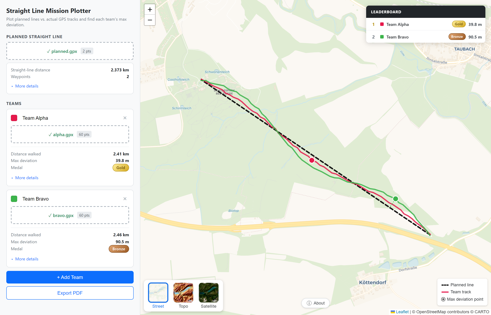

# Straight Line Mission Result Plotter

A single-file browser app for visualising and scoring [straight line missions](https://en.wikipedia.org/wiki/Straight_line_mission) — the challenge of walking in a perfectly straight line from point A to point B regardless of terrain, fences, rivers, and everything else in the way.

Drop in the planned line and each team's GPS track; the app overlays everything on a map, measures how far each team strayed, and ranks them on a leaderboard.

**Live site:** https://asamedia.github.io/straight-line-mission-result-plotter/

## Features

- **Planned line** from a GPX file (waypoints, route, or track — all supported)
- **Multiple teams** with per-team GPX **or** Garmin FIT tracks
- **Max deviation** per team, shown as a marker with a dashed perpendicular to the closest point on the planned line
- **Medal awards** based on max deviation:
  - ≤ 25 m — Platinum
  - ≤ 50 m — Gold
  - ≤ 75 m — Silver
  - ≤ 100 m — Bronze
- **Live leaderboard** (top-right of the map) that ranks teams by max deviation
- **Elevation profiles** (sparklines) plus ascent / descent / min–max from `<ele>` tags or FIT altitude records
- **Basemap switcher** with thumbnails — Street (CartoDB Voyager), Topo (OpenTopoMap with contour lines / Isohypsen), and Satellite (Esri World Imagery)
- **PDF export** — one A4 portrait page per team with name, rank, medal, full stats, a map snapshot (planned line + team track + max-deviation marker), and the elevation profile
- Accurate geometry (local 2D projection pipeline + Douglas–Peucker simplification + spatial grid index), with a Web Worker so stats computation doesn't block the UI

## Usage

1. Open the [live site](https://asamedia.github.io/straight-line-mission-result-plotter/) — or open [`index.html`](index.html) from a local clone; no build step, no local server required.
2. Drop the planned-line GPX into the **Planned Straight Line** slot.
3. Add a team, name it, and drop in the team's `.gpx` or `.fit` recording. Repeat for each team.
4. The map, leaderboard, and per-team stats update live.
5. Click **Export PDF** to generate a per-team report. The app spins up a fresh map for each team, waits for tiles to load, then opens the browser's print dialog — pick **Save as PDF** as the destination to get one A4 page per team.

## File formats

| Slot | Accepts | Notes |
| --- | --- | --- |
| Planned line | `.gpx` | Track points, route points, or waypoints — at least two |
| Team tracks | `.gpx`, `.fit` | Elevation read from `<ele>` / FIT `altitude` / `enhanced_altitude` |

## Credits

- [Leaflet](https://leafletjs.com/) — map engine
- [OpenStreetMap](https://www.openstreetmap.org/) + [CartoDB](https://carto.com/attributions) — street tiles
- [OpenTopoMap](https://opentopomap.org/) — topographic tiles with contour lines
- [Esri World Imagery](https://www.arcgis.com/home/item.html?id=10df2279f9684e4a9f6a7f08febac2a9) — satellite tiles
- [fit-file-parser](https://www.npmjs.com/package/fit-file-parser) — Garmin FIT decoding
