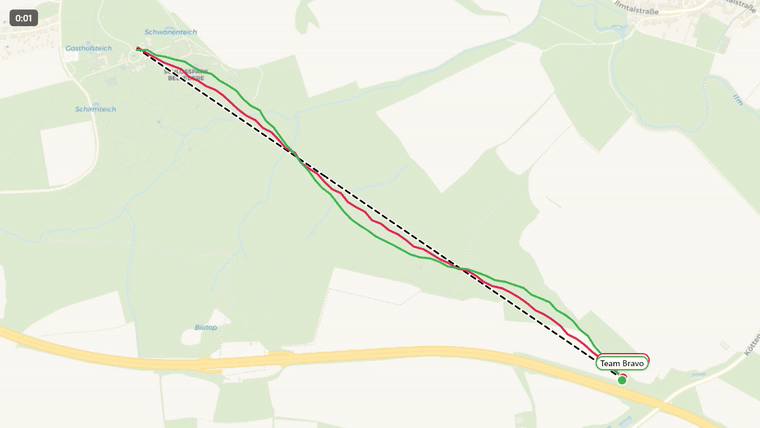
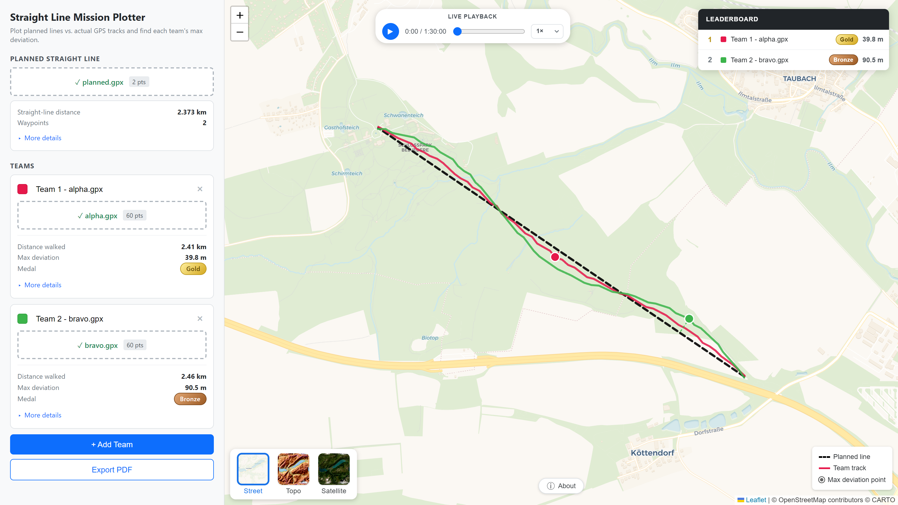
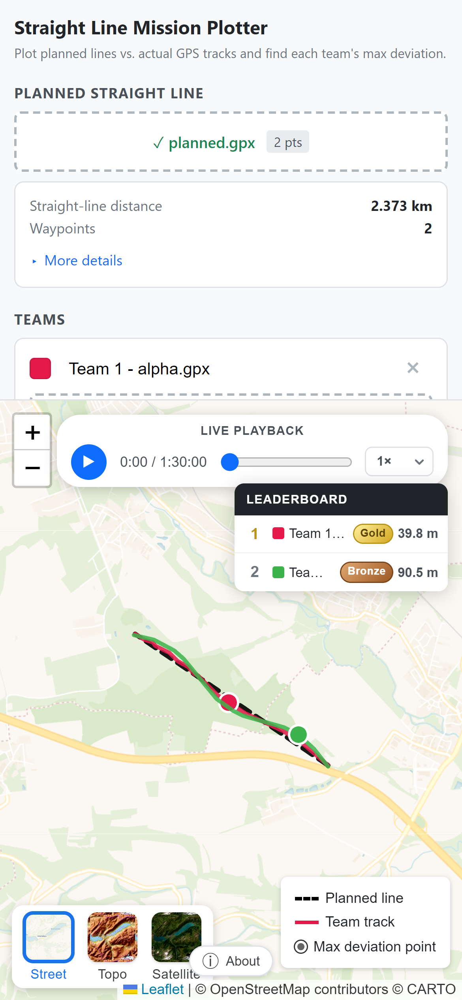

# Straight Line Mission Result Plotter

### Visualise, measure, and score [straight line missions](https://en.wikipedia.org/wiki/Straight_line_mission) — entirely in the browser.

Upload a planned line and each team's GPS track → get max deviation, medals, a live leaderboard, time-synced playback, PDF reports, and a recorded video — no accounts, no uploads to any server.

**[→ Open the live app](https://straightlinemission.app/)**

---

## See it in action

<em>Live playback along a ~2.4 km planned line near Weimar — two teams, sped up 500×, recorded with the app's built-in video export.</em>

## Desktop & mobile

<table align="center">
  <tr>
    <td valign="bottom"></td>
    <td valign="bottom"></td>
  </tr>
  <tr>
    <td align="center">Desktop — 3D terrain with basemap switcher expanded</td>
    <td align="center">Mobile — stacked sidebar over map</td>
  </tr>
</table>

---

## Quick start

1. **Open** the [live app](https://straightlinemission.app/) (or [`index.html`](index.html) from a local clone — no build, no install).
2. **Load a planned line:** drop a GPX file, or click **"or draw a line on the map →"** and tap two points.
3. **Add teams** and drop their `.gpx` or `.fit` recordings — one per team.
4. The map, leaderboard, medals, elevation profiles, and stats update instantly.

> Don't have files handy? Click **▶ Try with demo data** at the top of the sidebar — it loads a sample planned line and two simulated teams so you can explore every feature in one click.

---

## Features

### Input

- Planned line from GPX — track points, route points, or waypoints
- **Draw directly on the map** — click start, click end, done
- Team tracks from GPX **or** Garmin FIT (auto-patches malformed `data_size=0` headers from aborted eTrex recordings, and walks nested session/lap structures for records)
- **One-click demo data** for first-time visitors

### Scoring

- **Max deviation** per team — great-circle cross-track distance with 2D projection for speed
- Marker + dashed perpendicular drawn from each team's worst point to the planned line
- **Medal** awarded per team based on their deviation band
- **Live leaderboard** ranks teams by max deviation, updated on every change

### Maps

- **Collapsible basemap switcher** — click the active tile to reveal:
  - **Street** (CartoDB Voyager)
  - **Topo** (OpenTopoMap with contour lines / *Isohypsen*)
  - **Satellite** (Esri World Imagery)
  - **3D** terrain with pitch/rotate (MapLibre GL + AWS Terrain DEM, lazy-loaded on first click — no API key required)

### Playback

- **Live Playback** bar animating every team along its track at **1× / 5× / 10× / 20× / 50× / 100× / 200× / 500×**
- Normalised to each team's own start, so runs from different days can be compared side-by-side
- Scrub slider for jumping to any moment

### Stats

- Distance walked, max deviation, track point count, ascent/descent, min/max elevation, elevation range
- Inline sparkline **elevation profile** per team and for the planned line
- Coordinates, bearing, straight-line vs. polyline length in the planned-line info card

### Export

- **PDF** — one A4 portrait page per team: name, rank, medal, full stats, map snapshot (planned line + track + max-deviation marker), elevation profile
- **Video** — 1280×720 WebM with team-name labels floating above each marker and a live timecode; choose the playback speed to control video length
- **GPX** — download the current planned line as a standards-compliant GPX 1.1 file

### Under the hood

- Local 2D projection pipeline + Douglas–Peucker simplification + spatial grid index
- Web Worker keeps stats computation off the main thread so the UI never janks
- Single-file HTML; MapLibre GL + FIT parser are lazy-loaded from CDN only when the feature is first used
- Installable as a PWA with favicon, Apple touch icon, and manifest
- Fully mobile-friendly — sidebar stacks above the map on narrow viewports

---

## File formats

| Slot | Accepts | Notes |
| :-- | :-- | :-- |
| Planned line | `.gpx` | Waypoints, route, or track — needs ≥ 2 points. Can also be drawn directly on the map. |
| Team tracks | `.gpx`, `.fit` | Elevation read from `<ele>` / FIT `altitude` / `enhanced_altitude`. Timestamps (if present) enable playback and video export. |

## Medal thresholds

| Medal | Max deviation |
| :-- | :-- |
| Platinum | ≤ 25 m |
| Gold | ≤ 50 m |
| Silver | ≤ 75 m |
| Bronze | ≤ 100 m |

---

## Credits

- [Leaflet](https://leafletjs.com/) — 2D map engine
- [MapLibre GL JS](https://maplibre.org/) — 3D terrain rendering
- [OpenStreetMap](https://www.openstreetmap.org/) + [CartoDB](https://carto.com/attributions) — street tiles
- [OpenTopoMap](https://opentopomap.org/) — topographic tiles with contour lines
- [Esri World Imagery](https://www.arcgis.com/home/item.html?id=10df2279f9684e4a9f6a7f08febac2a9) — satellite tiles
- [AWS Terrain Tiles](https://registry.opendata.aws/terrain-tiles/) — DEM data for 3D terrain
- [fit-file-parser](https://www.npmjs.com/package/fit-file-parser) — Garmin FIT decoding
- [GeoWizard / Tom Davies](https://www.youtube.com/@GeoWizard) — for popularising the straight line mission genre that inspired this project

---

Created with ♥ by **[Axel Schorcht](https://axel-schorcht.de)** · [info@axel-schorcht.de](mailto:info@axel-schorcht.de)

© 2026 Axel Schorcht · All rights reserved

